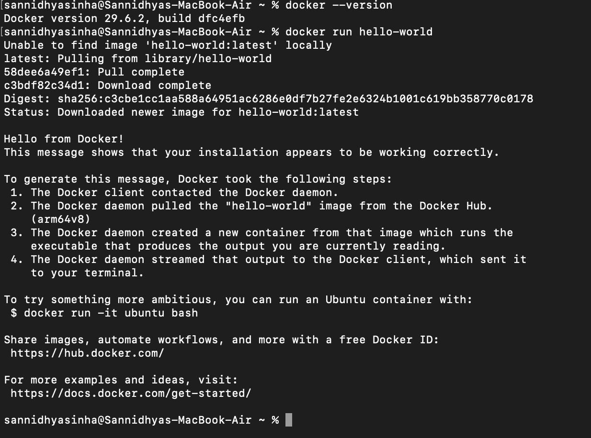
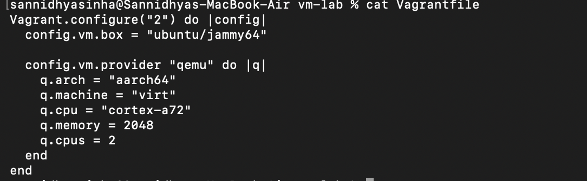
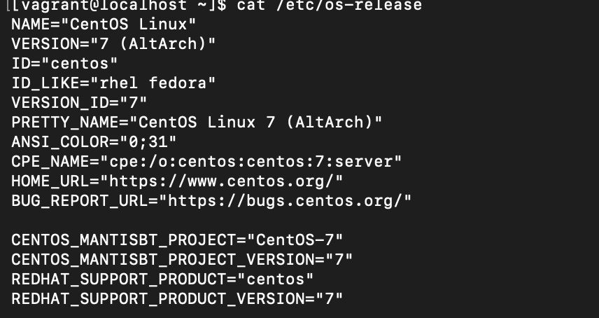

# Experiment 1: Creation and Management of a Virtual Machine Using Vagrant

## Aim
To create and manage a virtual machine using Vagrant and QEMU.

## Objective
- Install and configure Vagrant.
- Create a virtual machine using a Vagrantfile.
- Start and access the virtual machine.
- Verify its successful execution.

## Theory
Vagrant is an open-source tool used to create and manage virtual machines through a configuration file called the Vagrantfile. It provides a consistent development environment. QEMU is an open-source machine emulator and virtualizer that enables virtual machines to run on Apple Silicon systems.

## Commands Used

```bash
docker --version
docker run hello-world
qemu-system-aarch64 --version
vagrant --version
vagrant plugin list
mkdir vm-lab
cd vm-lab
vagrant init
vagrant up
vagrant status
vagrant ssh
uname -a
cat /etc/os-release
```

## Screenshots

### Docker Installation


### Docker Hello World


### QEMU Version


### Vagrant Version


### Vagrant Plugin


### Vagrantfile


### Starting Virtual Machine


### VM Status


### SSH into VM


### System Information


### OS Details


## Result

The virtual machine was successfully created using Vagrant and QEMU. The VM was started, accessed through SSH, and its operating system information was verified successfully.