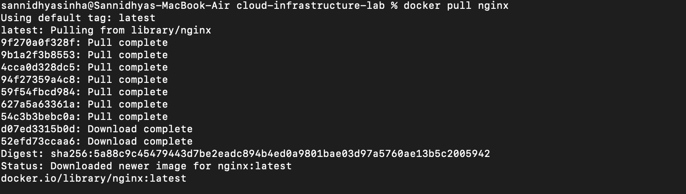

# Experiment 2: Docker Installation and Pulling an Image

## Aim

To download a Docker image from Docker Hub using Docker.

## Objective

- Understand Docker images.
- Pull an image from Docker Hub.
- Verify successful image download.

## Theory

Docker images are read-only templates used to create containers. Images are stored on Docker Hub and can be downloaded using the `docker pull` command.

## Commands Used

```bash
docker pull nginx
```

## Screenshot

### Pulling the Nginx Image



## Result

The official Nginx Docker image was successfully downloaded from Docker Hub.