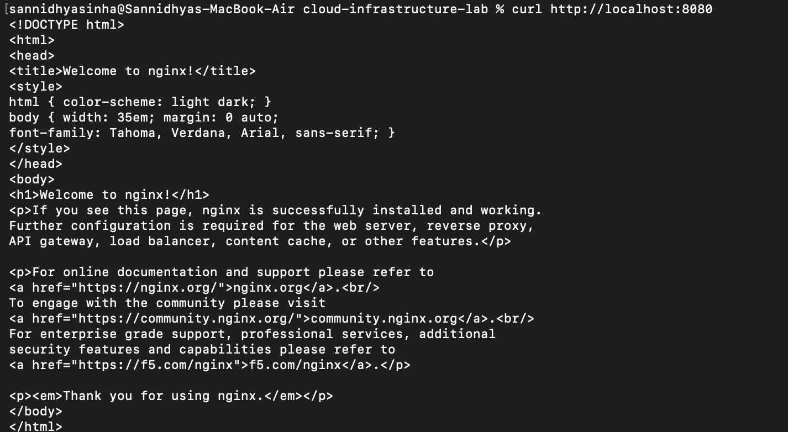
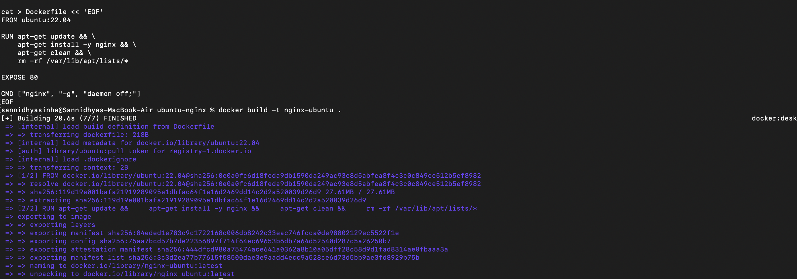
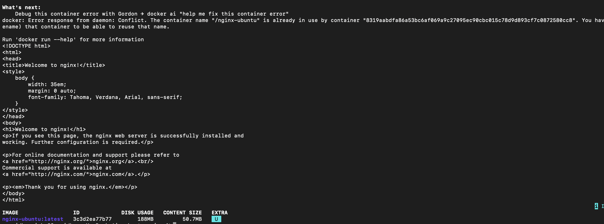
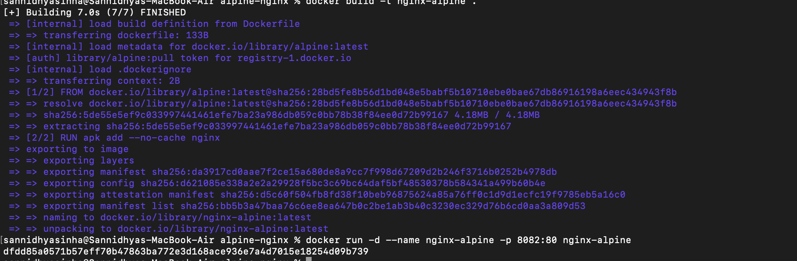
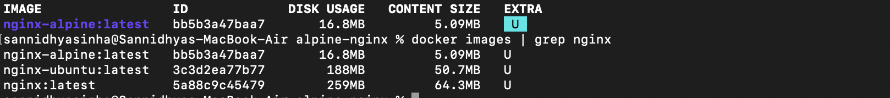
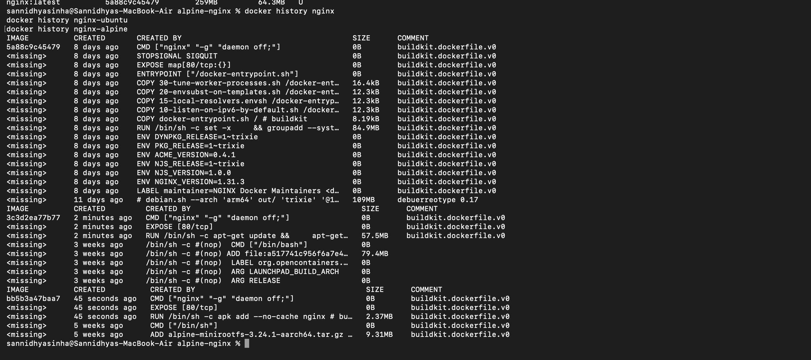
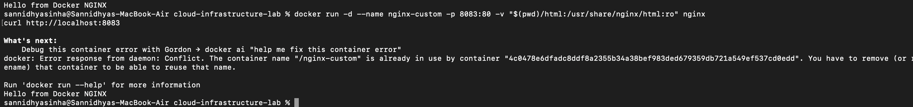

# Experiment 3: Working with Docker Images and Containers

## Aim

To understand Docker images, create containers, build custom Docker images, and inspect image history.

## Objective

- Pull Docker images from Docker Hub.
- Build custom Docker images.
- Run Docker containers.
- View Docker image history.
- Use bind mounts to serve custom web content.

## Theory

Docker images are templates used to create containers. Custom images can be created using a Dockerfile. Docker also allows mounting local files into containers so that changes on the host system are reflected inside the running container.

## Commands Used

```bash
docker images
docker run
docker build
docker history
docker ps
docker exec
```

## Screenshots

### Docker Images



### Running Container


### Ubuntu Dockerfile



### Alpine Dockerfile



### Building Docker Image



### Docker History



### Docker Containers



### Custom HTML Bind Mount


### Final Output



## Result

Docker images were successfully inspected and custom images were built using Dockerfiles. Containers were executed successfully, image history was verified, and a bind mount was used to serve custom HTML content through an Nginx container.