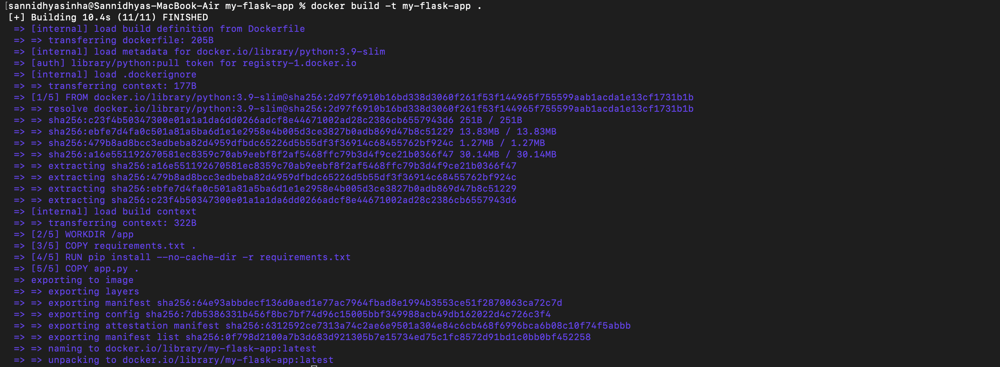
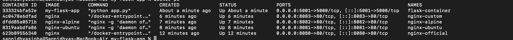
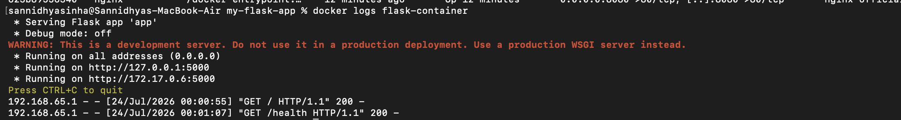
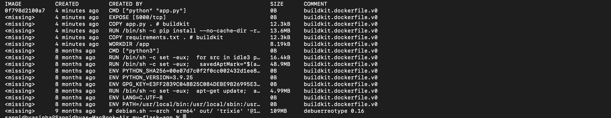
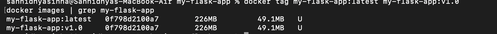

# Experiment 4: Creating a Custom Docker Image Using Dockerfile

## Aim

To create a custom Docker image for a Flask application using a Dockerfile and execute it inside a Docker container.

## Objective

- Create a Flask application.
- Write a Dockerfile for the application.
- Build a custom Docker image.
- Run the Docker container.
- Verify the application through the browser.

## Theory

A Dockerfile is a text file containing instructions used to build a Docker image. It automates the application deployment process by packaging the application, its dependencies, and the runtime environment into a portable container.

## Commands Used

```bash
docker build -t flask-app .
docker images
docker run -d -p 5001:5000 flask-app
docker ps
curl http://localhost:5001
docker logs
docker history
```

## Screenshots

### Building Docker Image



### Docker Images


### Running Container


### Verifying Running Container



### Browser Output



### Application Response



### Docker Logs



### Docker History


## Result

A custom Docker image for the Flask application was successfully created using a Dockerfile. The container was executed successfully, the application was accessed through the browser, and the container logs and image history were verified.