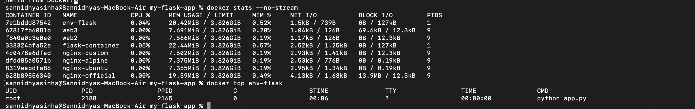
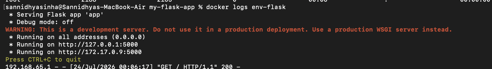
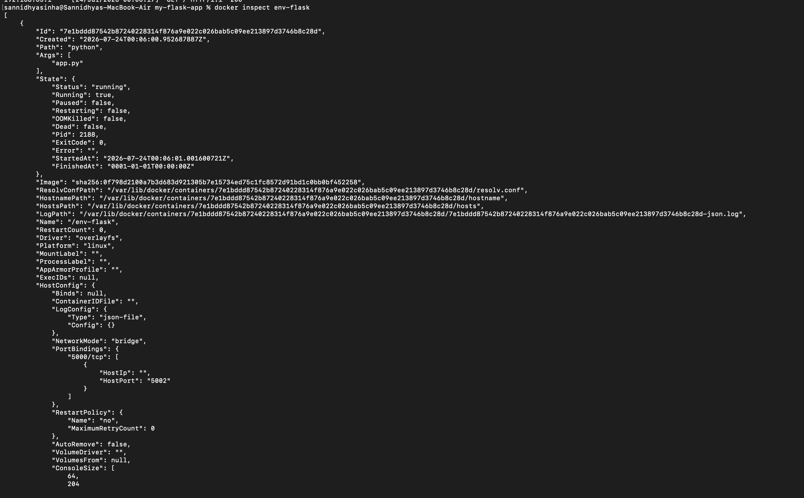
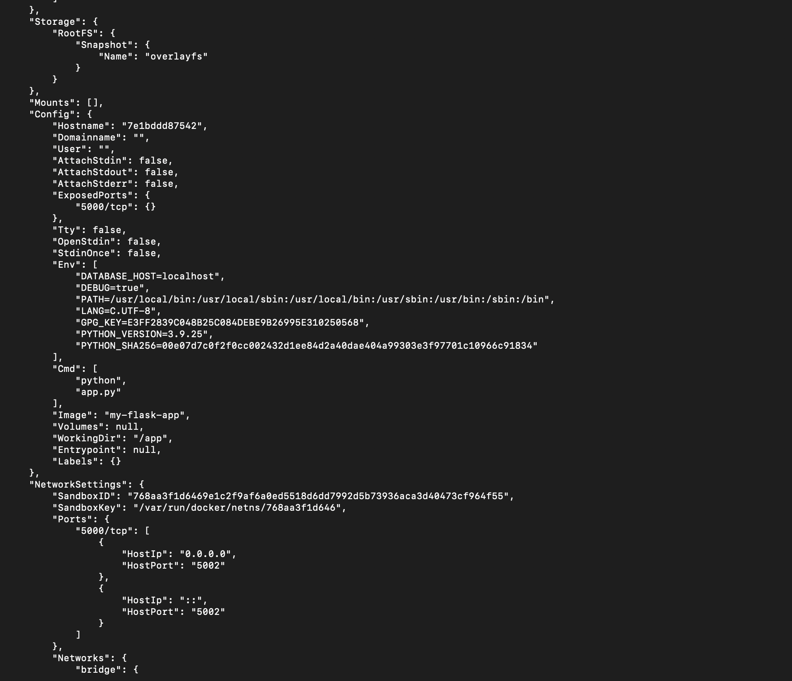
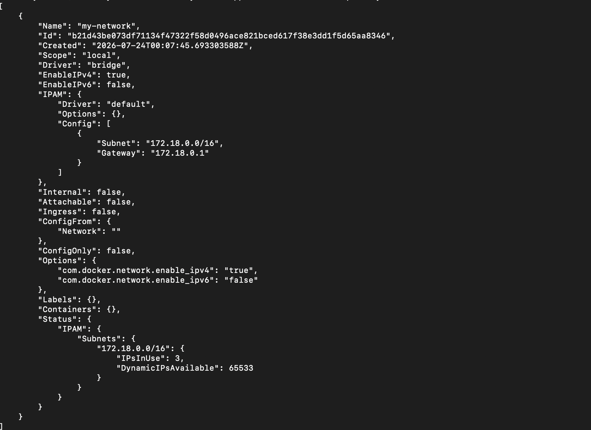
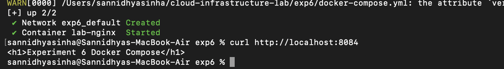

# Experiment 5: Docker Volumes, Networks and Container Management

## Aim

To understand Docker volumes, bind mounts, environment variables, container inspection, logs, and networking.

## Objective

- Create and use Docker volumes.
- Use bind mounts for persistent storage.
- Configure environment variables.
- Inspect Docker containers.
- Monitor container resources and logs.

## Theory

Docker provides persistent storage through volumes and bind mounts. It also allows monitoring and managing containers using commands such as `inspect`, `logs`, `stats`, and `network`. These features help in managing containerized applications efficiently.

## Commands Used

```bash
docker volume create
docker run
docker volume ls
docker inspect
docker logs
docker stats
docker top
docker network ls
docker network inspect
```

## Screenshots

### Docker Volume Creation


### Docker Volumes


### Running Container


### Docker Networks


### Network Inspection



### Container Logs



### Docker Inspect



### Container Details


### Docker Statistics



### Container Processes



### Network Configuration


### Environment Variables



### Final Verification


## Result

Docker volumes, bind mounts, networks, and container management commands were successfully executed. Container information, logs, statistics, and network details were verified successfully.