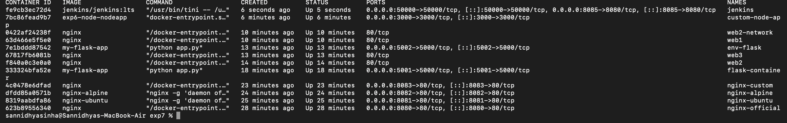
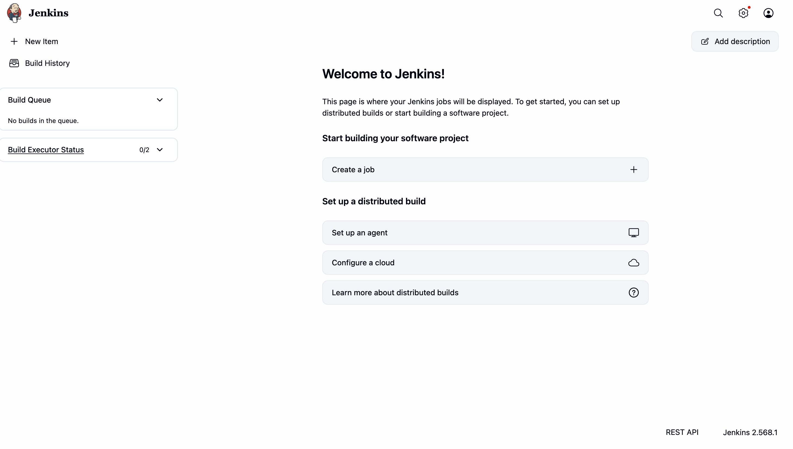
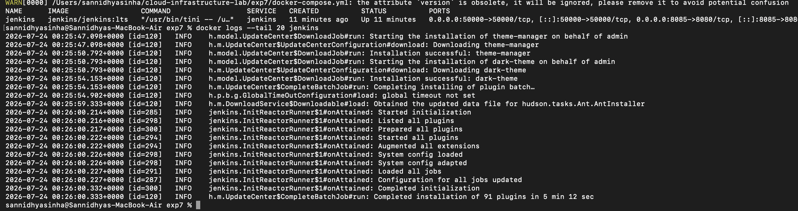

# Experiment 7: Continuous Integration Using Jenkins and Docker

## Aim

To install and configure Jenkins using Docker and understand the basics of Continuous Integration (CI).

## Objective

- Deploy Jenkins using Docker Compose.
- Access the Jenkins dashboard.
- Configure the initial Jenkins setup.
- Verify the Jenkins installation.

## Theory

Jenkins is an open-source Continuous Integration and Continuous Delivery (CI/CD) automation server. It helps automate software building, testing, and deployment through pipelines. Running Jenkins inside Docker provides an isolated and portable environment that can be managed easily.

## Commands Used

```bash
docker-compose up -d
docker ps
docker logs jenkins
docker-compose ps
```

## Screenshots

### Starting Jenkins Container



### Docker Containers


### Jenkins Initial Setup



### Jenkins Dashboard



## Result

Jenkins was successfully deployed using Docker. The Jenkins dashboard was accessed successfully, confirming that the Continuous Integration environment was configured correctly.