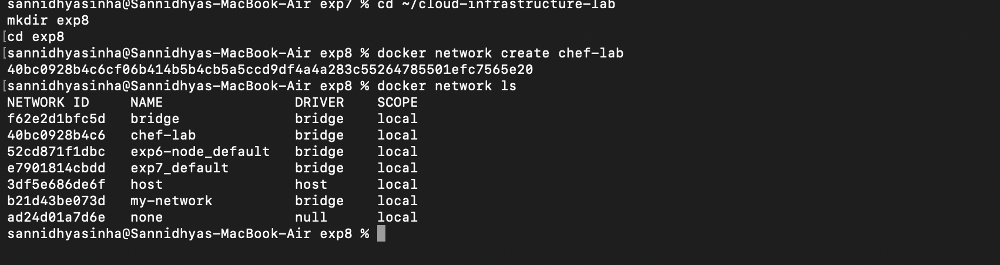
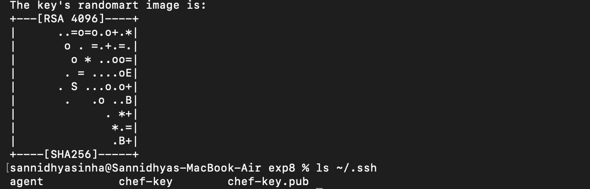
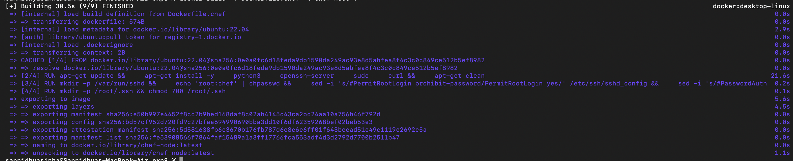
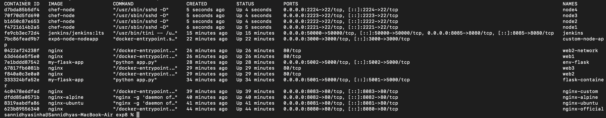
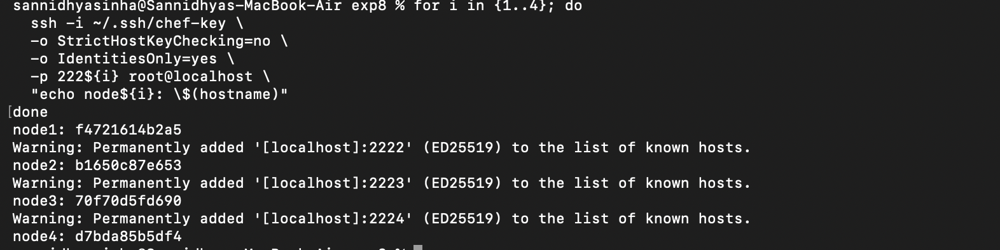
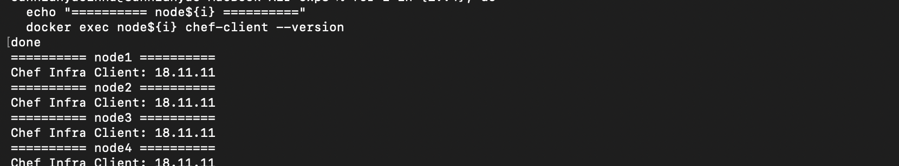
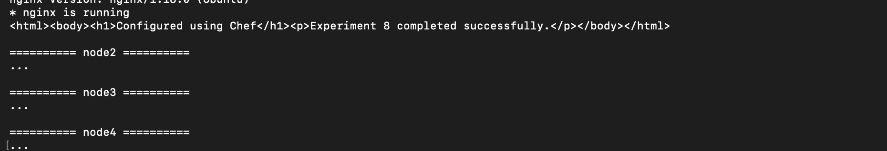

# Experiment 8: Configuration Management Using Chef

## Aim

To understand the basics of Chef and perform configuration management using Chef cookbooks inside a Docker container.

## Objective

- Build a Docker image with Chef installed.
- Verify the Chef installation.
- Create a Chef cookbook.
- Execute a Chef recipe.
- Verify the applied configuration.

## Theory

Chef is a configuration management tool that automates infrastructure provisioning and system configuration using cookbooks and recipes. It enables consistent deployment and management of systems through Infrastructure as Code (IaC).

## Commands Used

```bash
docker build
docker run
chef-client --version
chef generate cookbook
chef-client -z
docker ps
docker images
```

## Screenshots

### Building Chef Docker Image



### Running Chef Container



### Verifying Chef Installation



### Generating Cookbook



### Cookbook Structure



### Editing Recipe



### Executing Chef Recipe


### Verifying Configuration



### Final Output


## Result

Chef was successfully installed and configured inside a Docker container. A cookbook was created, the recipe was executed successfully, and the desired configuration was applied successfully.