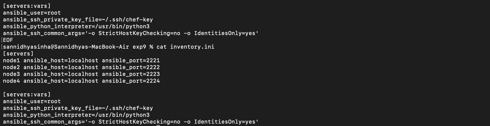
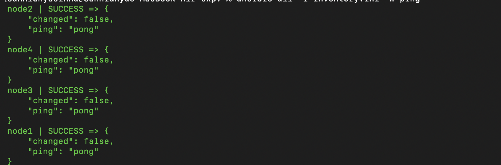
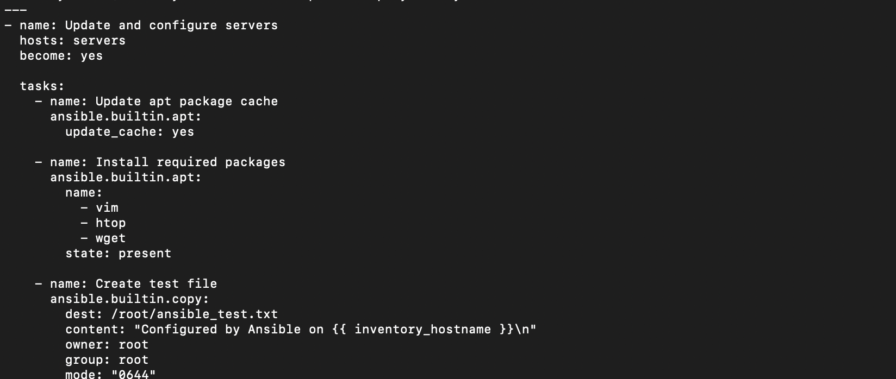
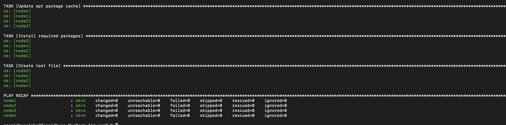

# Experiment 9: Configuration Management Using Ansible

## Aim

To automate system configuration and software deployment using Ansible.

## Objective

- Understand the basics of Ansible.
- Create an Ansible inventory file.
- Write an Ansible playbook.
- Execute the playbook.
- Verify the configuration changes.

## Theory

Ansible is an open-source automation and configuration management tool. It uses YAML-based playbooks to automate software installation, configuration, and infrastructure management. Ansible is agentless and communicates with managed systems using SSH.

## Commands Used

```bash
ansible --version
ansible all -i inventory.ini -m ping
ansible-playbook -i inventory.ini playbook1.yml
docker ps
```

## Screenshots

### Verifying Ansible Installation


### Inventory Configuration



### Creating Playbook



### Running the Playbook



### Playbook Execution


### Task Execution


### Configuration Applied



### Verification Output


### Docker Container


### Final Output


### Additional Verification


### Successful Execution


### Final Result


### Completed Experiment


## Result

Ansible was successfully configured and used to automate system configuration. The inventory file and playbook were executed successfully, and the desired configuration was applied and verified.