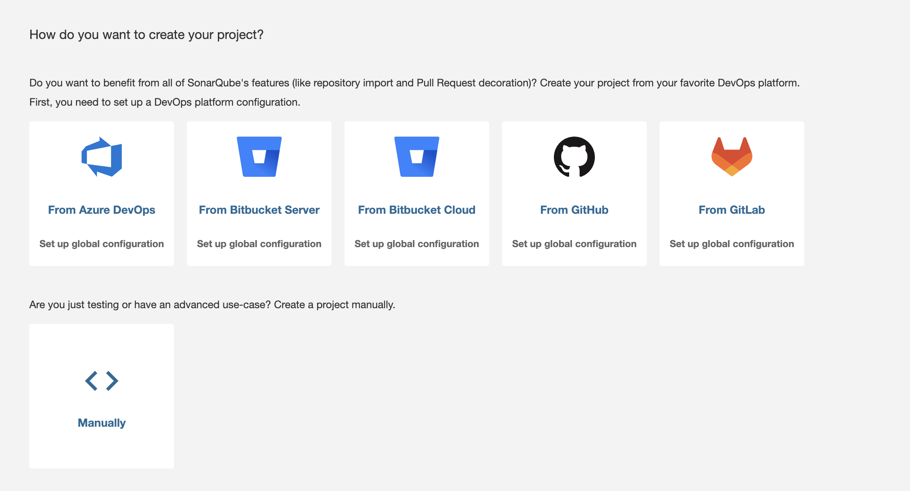
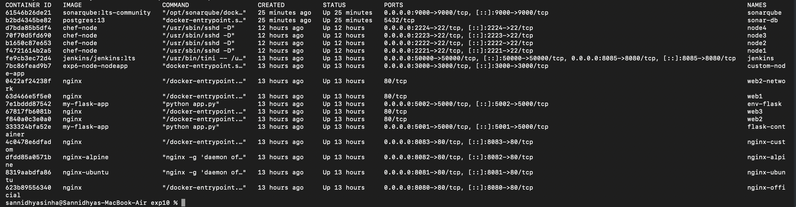
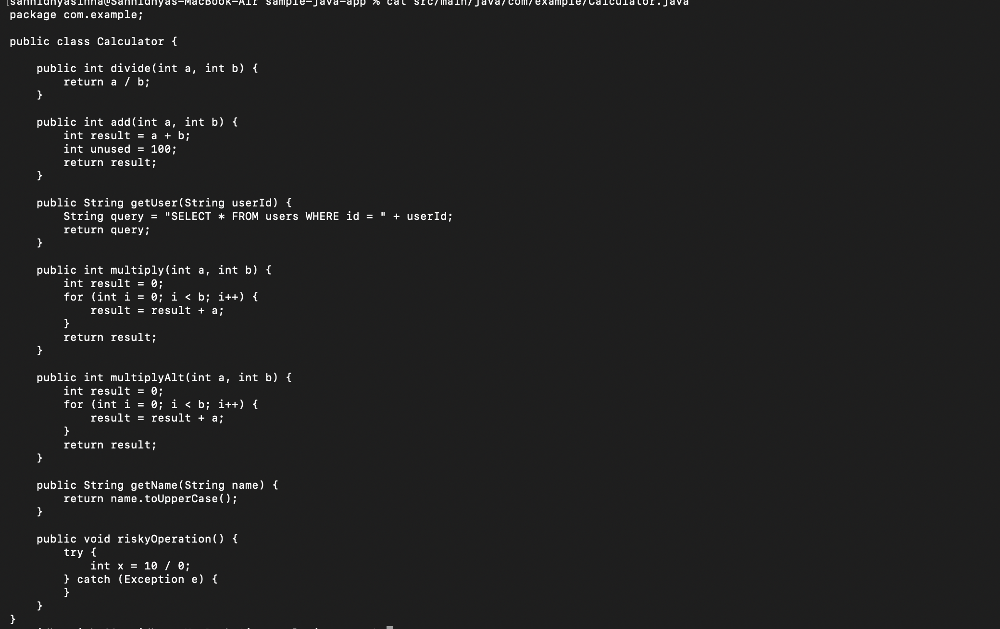
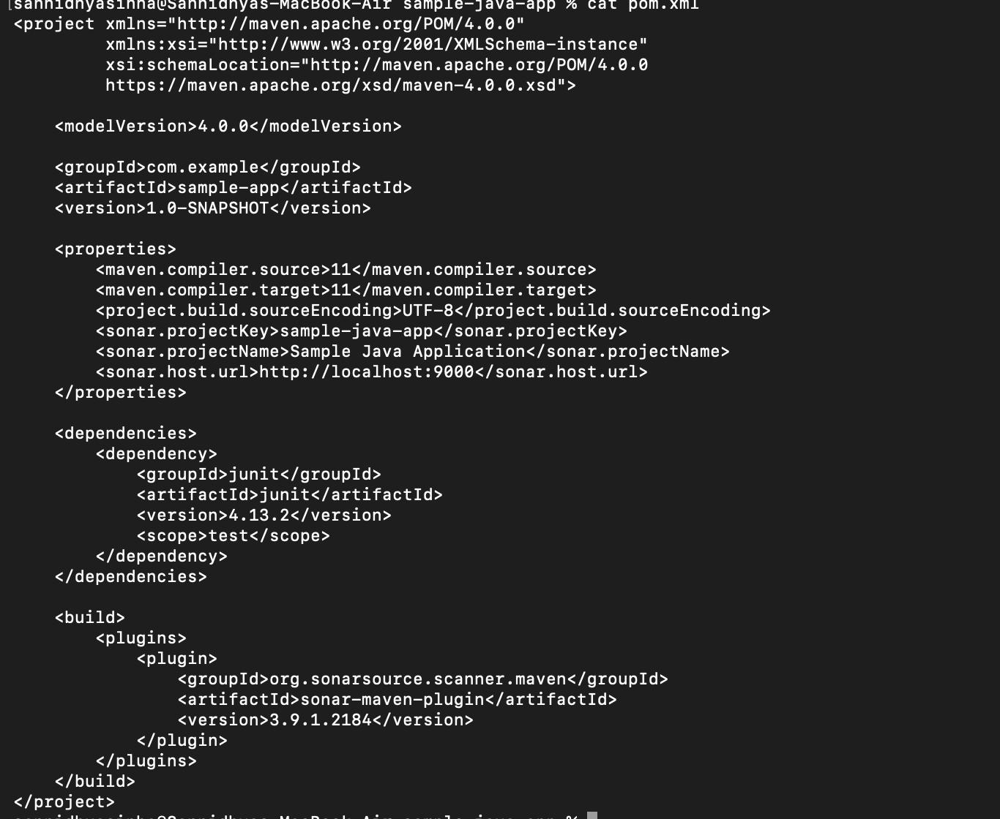

# Experiment 10: Static Code Analysis Using SonarQube

## Aim

To perform static code analysis on a Java application using SonarQube and identify code quality issues.

## Objective

- Set up SonarQube.
- Create a Java Maven project.
- Configure the Sonar Maven plugin.
- Analyze the project using SonarQube.
- Review the analysis results.

## Theory

SonarQube is a static code analysis platform used to inspect source code for bugs, vulnerabilities, code smells, and maintainability issues. It integrates with build tools such as Maven and helps improve software quality by providing detailed analysis reports.

## Commands Used

```bash
docker ps
mvn clean verify
mvn sonar:sonar
```

## Screenshots

### SonarQube Project Creation



### Verifying Running Containers



### Maven Project Configuration



### Java Source Code



## Result

A Java Maven project was successfully analyzed using SonarQube. The project configuration, source code, and analysis setup were completed successfully, enabling static code quality assessment.