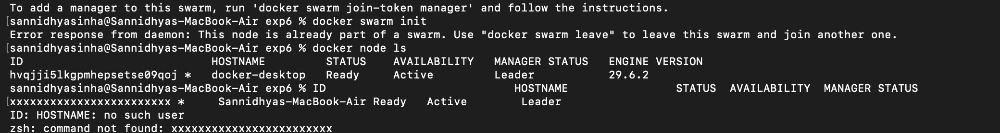
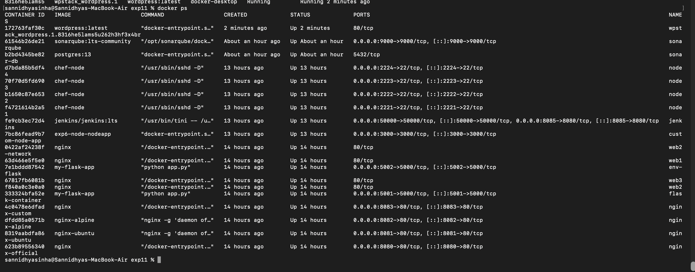

# Experiment 11: Docker Swarm and Stack Deployment

## Aim

To understand Docker Swarm and deploy a multi-service application using Docker Stack.

## Objective

- Initialize a Docker Swarm.
- Deploy a stack using Docker Stack.
- Verify the running services.
- Access the deployed WordPress application.
- Monitor the stack and services.

## Theory

Docker Swarm is Docker's native container orchestration platform that allows multiple Docker hosts to work together as a cluster. Using Docker Stack, applications consisting of multiple services can be deployed and managed efficiently within the swarm.

## Commands Used

```bash
docker swarm init
docker node ls
docker stack deploy
docker stack services
docker service ls
docker stack ps
docker ps
```

## Screenshots

### Initializing Docker Swarm



### Running Docker Containers



### Stack Services


### Service Details


### WordPress Dashboard


### Stack Deployment Verification


## Result

Docker Swarm was successfully initialized, and the WordPress application stack was deployed successfully using Docker Stack. The services were verified, and the application was accessed successfully through the browser.