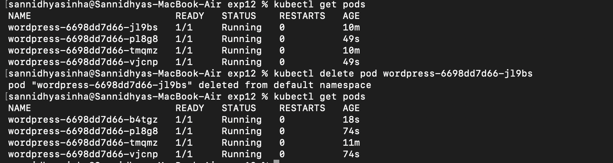
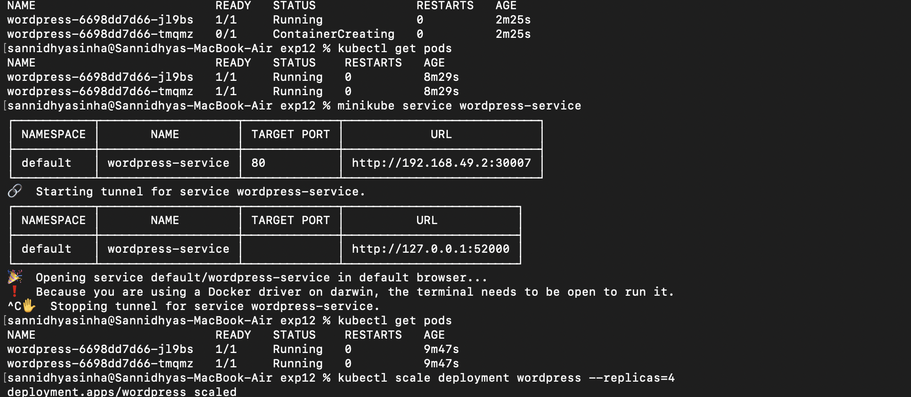
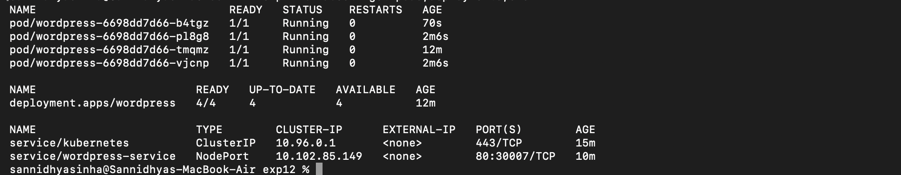

# Experiment 12: Kubernetes Deployment Using Minikube

## Aim

To deploy and manage an application in a Kubernetes cluster using Minikube and verify the deployment and services.

## Objective

- Create a Kubernetes deployment.
- Expose the deployment as a service.
- Verify the running pods and services.
- Access the deployed application.

## Theory

Kubernetes is a container orchestration platform that automates the deployment, scaling, and management of containerized applications. Minikube provides a lightweight local Kubernetes cluster for learning and development. Deployments manage application replicas, while Services expose applications for network access.

## Commands Used

```bash
kubectl get pods
kubectl get services
kubectl expose deployment wordpress --type=NodePort
minikube service wordpress-service --url
```

## Screenshots

### Verifying Running Pods



### Exposing the Deployment and Accessing the Service



### Verifying Services and Deployment



## Result

The application was successfully deployed on the Kubernetes cluster using Minikube. The deployment, pods, and services were verified successfully, and the application was exposed and accessed through a NodePort service.